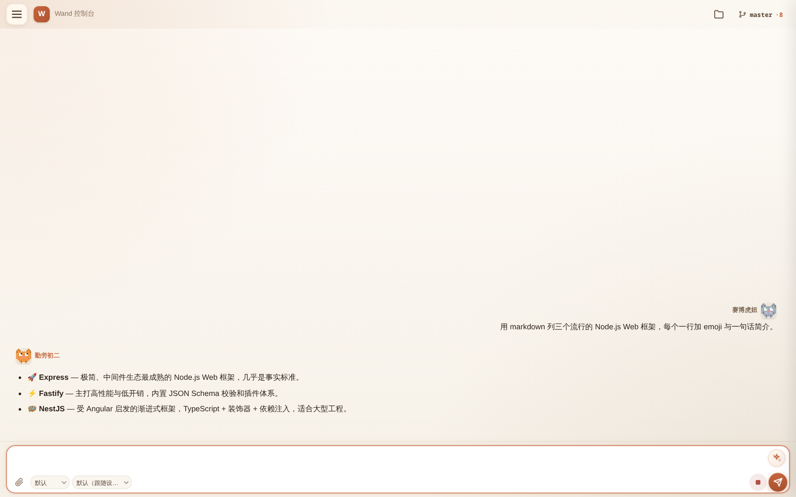
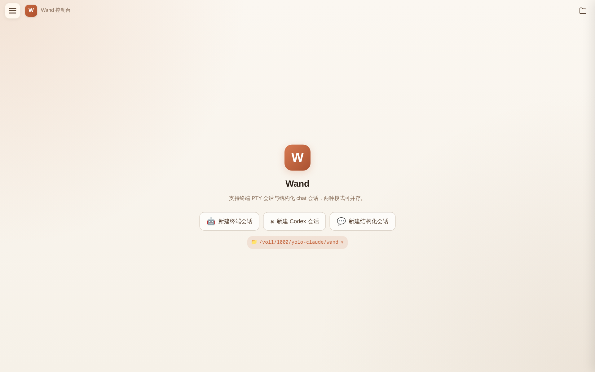
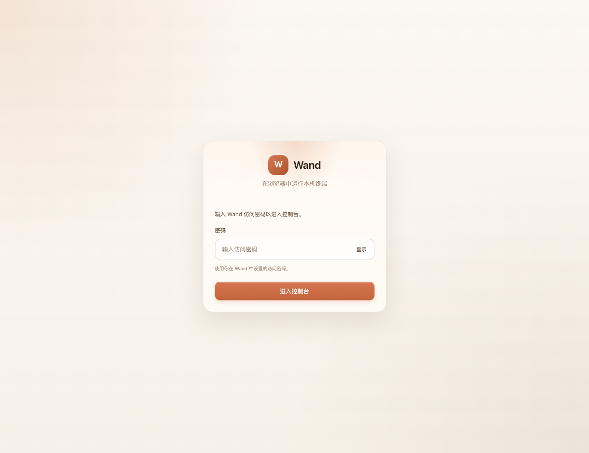
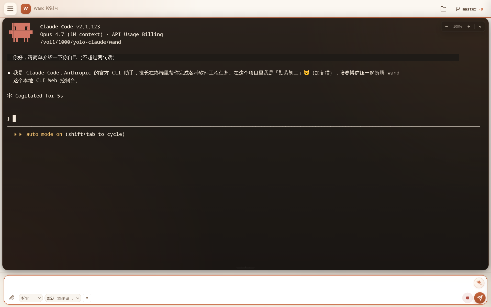

# wand

[](https://www.npmjs.com/package/@co0ontty/wand)
[](https://github.com/co0ontty/wand/blob/master/LICENSE)
[](https://nodejs.org)
[](https://github.com/co0ontty/wand/commits/master)

通过浏览器远程访问和管理本地 CLI 工具的 Web 控制台。专为 [Claude Code](https://docs.anthropic.com/en/docs/claude-code) 和 [Codex](https://github.com/openai/codex) 设计，支持终端和结构化对话双视图、会话持久化与恢复、权限管控、文件浏览、Android 客户端等功能。

<p align="center">
  
</p>

## 安装

### 一键安装

自动检测并安装 Node.js（需要 v22+），然后安装 wand：

```bash
bash <(curl -Ls https://raw.githubusercontent.com/co0ontty/wand/master/install.sh)
```

装完后脚本会询问：

- **1) 装为系统服务（推荐，默认）** — 写入 system-wide systemd（`/etc/systemd/system/wand.service`）或 launchd LaunchDaemon（`/Library/LaunchDaemons/com.wand.web.plist`），后台运行、开机自启、崩了自重启。**需要 sudo**（脚本会自动加）。
- **2) 单次启动** — 不装服务，之后手动跑 `wand web`。

> 通过管道运行（`bash <(curl ...)`）时 stdin 不是终端，默认走 **1（系统服务）**。想强制单次启动可以 `WAND_INSTALL_MODE=oneshot bash install.sh`。
>
> 不想用 sudo？可以装 user-level 版本：`wand service:install --user`（写入 `~/.config/systemd/user/wand.service`，登出会被回收，除非 `loginctl enable-linger $USER`）。

### 手动安装

```bash
npm install -g @co0ontty/wand
wand init
sudo wand service:install   # 装为系统服务（system-wide, 默认）
# 或者：wand service:install --user   # 不要 sudo，但登出会被回收
wand web                    # 没服务时启动新实例；有服务时 attach TUI
```

安装完成后打开浏览器访问终端中提示的地址即可。

### 升级

推荐用同一条一键脚本升级（脚本会自动停掉正在运行的 wand 进程、清理 npm 改名残留再装最新版）：

```bash
bash <(curl -Ls https://raw.githubusercontent.com/co0ontty/wand/master/install.sh)
```

> 也可以直接在网页设置里点「更新」按钮，或在 TUI 模式按 `u`，wand 自己会调用同样的清理逻辑。Web 端点击更新后会自动重启服务，无需手动操作。

如果以前装过 systemd 自启服务但还是 `Restart=on-failure`（v1.25.x 前的版本），重新跑 `sudo wand service:install` 重装服务即可换成 `Restart=always`，自动更新后才能正确拉起新进程。

## 功能

<p align="center">
  
</p>

### 核心

- **双视图模式** — 终端原始输出和结构化对话视图可随时切换，同一会话两种呈现
- **多 Provider 支持** — 同时支持 Claude Code 和 Codex，可按需创建不同类型的会话
- **会话管理** — 创建、归档、恢复会话；支持从 Claude 原生历史记录恢复；会话列表显示摘要，懒加载
- **权限控制** — 可视化权限提示，支持逐次确认、单次批准、本轮记忆等策略；工具调用自动分组与审批统计

### 交互体验

- **结构化对话** — 代码块语法高亮、工具调用折叠/展开、多问题分组渲染、Token 用量按轮累计
- **个性化角色** — 像素风猫咪头像（赛博虎妞 / 勤劳初二），支持自定义对话角色名称
- **消息排队** — 在 AI 思考时可继续输入，消息自动排队发送
- **文件浏览器** — 内置路径浏览和搜索功能

### 部署与访问

- **PWA 支持** — 可添加到主屏幕作为独立应用使用
- **Android 客户端** — WebView 壳应用，支持加密连接码分发、APK 自动更新检查、原生通知推送、启动器图标切换
- **HTTPS** — 可选自签证书，适合远程或移动端访问
- **版本管理** — 内置更新检查与升级提示

## 截图

| 登录 | 对话视图 |
|:---:|:---:|
|  |  |

| 终端 PTY 视图 |
|:---:|
|  |

## 配置

配置文件位于 `~/.wand/config.json`，首次 `wand init` 时自动生成。

```bash
wand config:path           # 查看配置文件路径
wand config:show           # 查看当前配置
wand config:set host 0.0.0.0  # 修改配置项
wand config:set port 9443
```

常用配置项：

| 字段 | 默认值 | 说明 |
|------|--------|------|
| `host` | `127.0.0.1` | 监听地址，`0.0.0.0` 允许远程访问 |
| `port` | `8443` | 监听端口 |
| `https` | `false` | 启用 HTTPS（自签证书自动生成） |
| `password` | (随机生成) | 登录密码 |
| `language` | `""` | Claude 回复语言偏好 |

## 系统服务

默认走 **system-wide**：Linux 写 `/etc/systemd/system/wand.service`，macOS 写 `/Library/LaunchDaemons/com.wand.web.plist`。开机自启、不依赖 login session、`service wand` / `systemctl status wand` 这些老命令都能用。装/卸需要 sudo。

```bash
sudo wand service:install   # 注册并启动（首次安装走这里）
wand service:status         # 查状态（active / inactive / failed） — 读取不要 sudo
sudo wand service:start     # 启动
sudo wand service:stop      # 停止
sudo wand service:restart   # 重启
wand service:logs           # 看最近日志（--lines N 调整行数）
sudo wand service:uninstall # 卸载（停服 + 删 unit）
```

不想用 sudo？传 `--user` 切到 user-level（写 `~/.config/systemd/user/wand.service` 或 `~/Library/LaunchAgents/`）：

```bash
wand service:install --user
wand service:status --user
# ...其他子命令同理
```

> User-level 版本登出后会被回收，除非跑 `loginctl enable-linger $USER`。

服务装好后，`wand web` 会自动检测正在运行的实例（同一份 `config.json` 下）并以 TUI 模式 **attach 到现有 service**，不会重复启动第二个进程。多份配置（`-c` 指向不同路径）之间彼此隔离，互不影响。

## 开发

```bash
npm install                # 安装依赖
npm run dev                # 从源码直接启动开发服务器
npm run check              # TypeScript 类型检查
npm run build              # 编译 + 复制静态资源到 dist/
```

隔离测试环境（不影响生产实例）：

```bash
npm run dev -- -c /tmp/wand-test/config.json
```

## 项目结构

```
src/
  cli.ts                    # CLI 入口，解析命令和参数
  server.ts                 # Express 服务器、REST API、WebSocket
  server-session-routes.ts  # 会话/恢复/历史相关路由
  process-manager.ts        # PTY 会话编排、输入输出路由、权限处理
  claude-pty-bridge.ts      # PTY 输出解析为结构化对话数据
  storage.ts                # SQLite 持久化
  config.ts                 # 配置加载与合并
  session-lifecycle.ts      # 会话状态机（idle/thinking/waiting/archived）
  session-logger.ts         # 文件日志 ~/.wand/sessions/
  resume-policy.ts          # Claude 历史绑定与恢复策略
  web-ui/                   # 服务端渲染的前端 HTML/CSS/JS
android/                    # Android WebView 壳应用
```

数据存储在 `~/.wand/` 下：`config.json`（配置）、`wand.db`（SQLite）、`sessions/`（日志）。

## License

MIT
