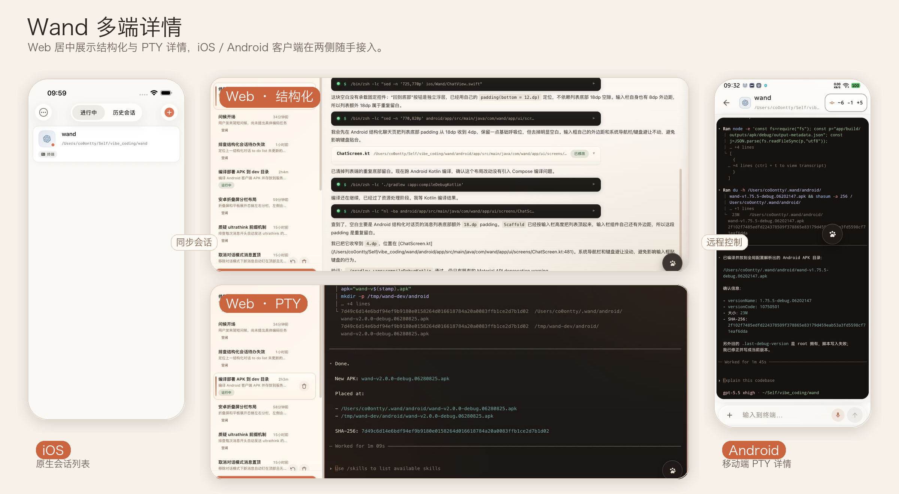
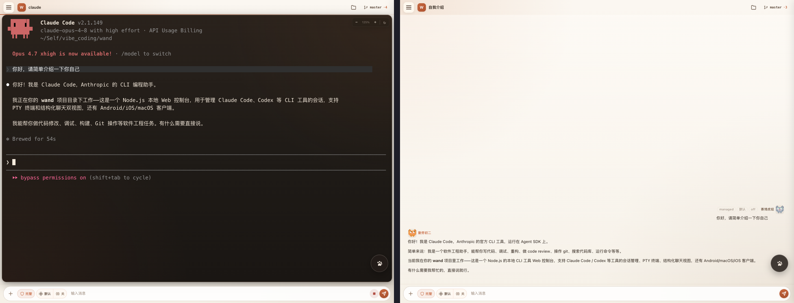
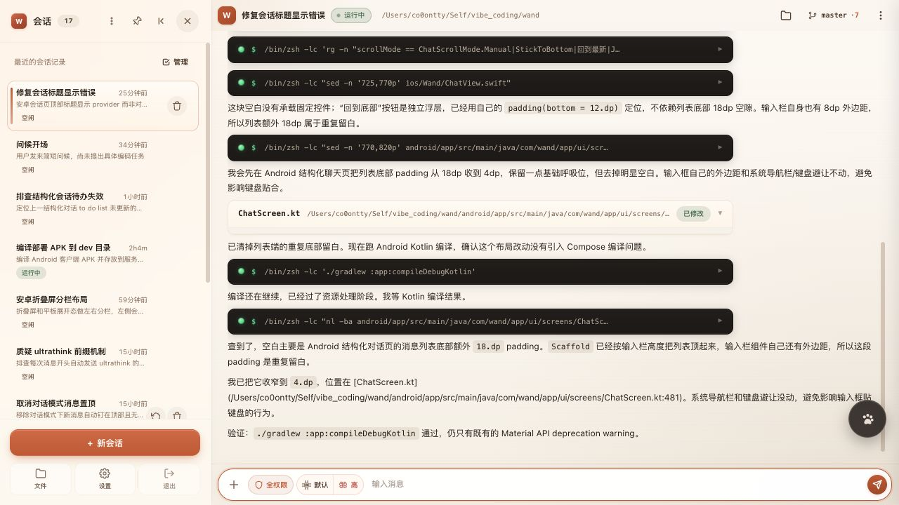
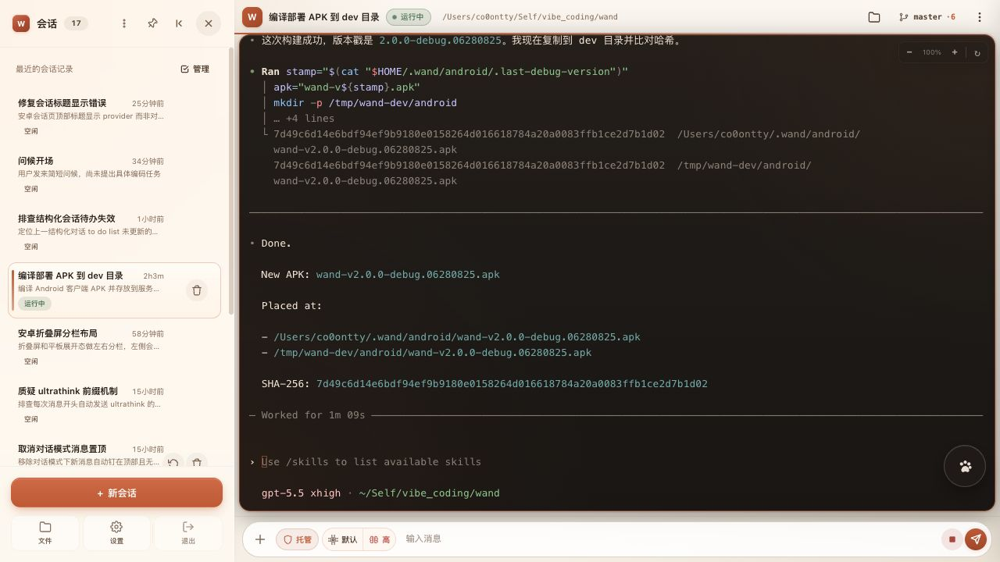
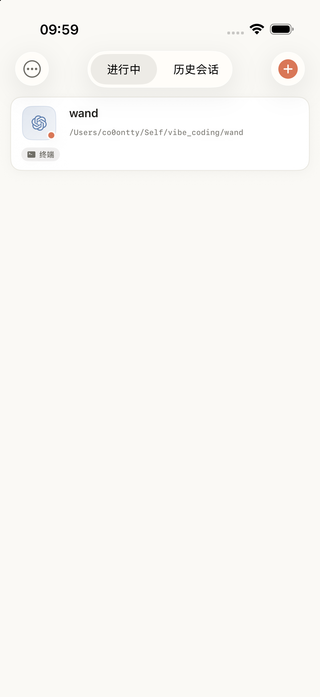
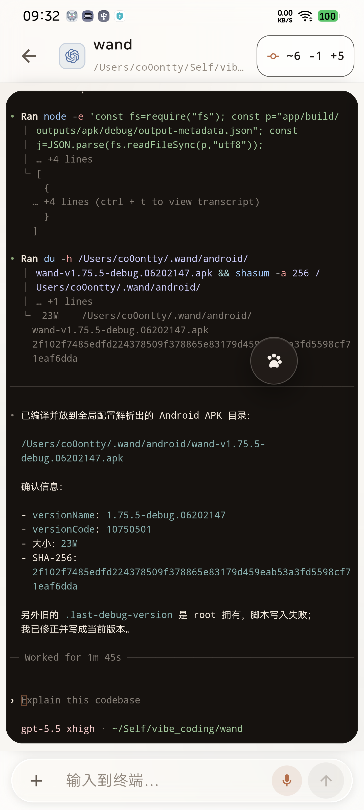
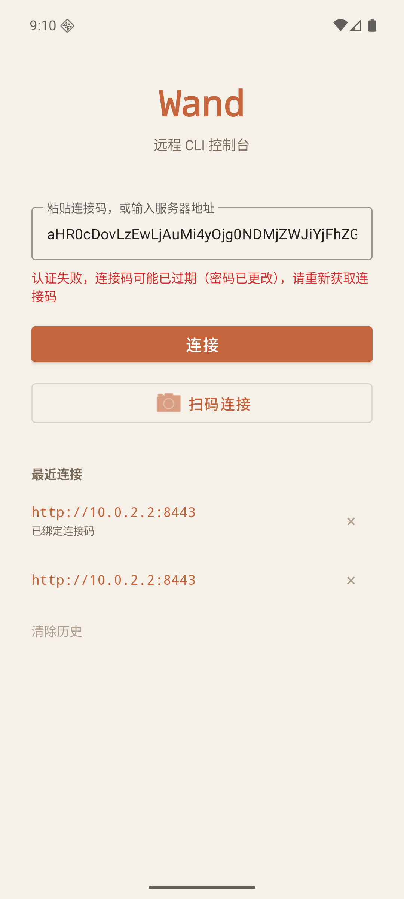
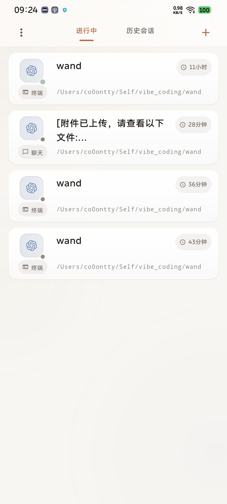
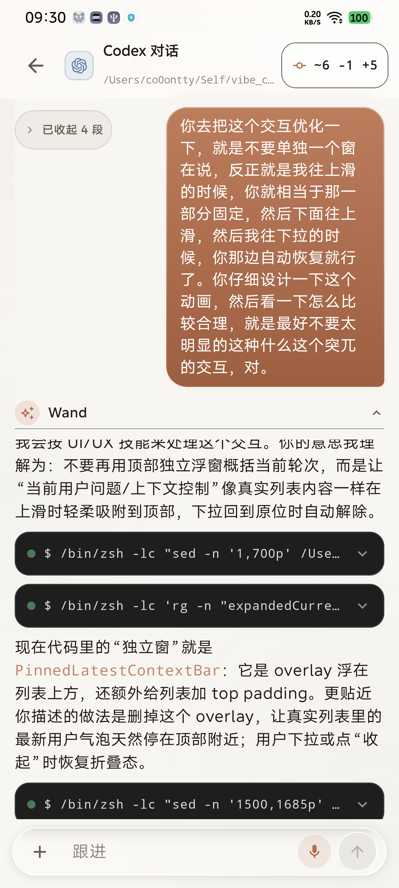

# wand

[](https://www.npmjs.com/package/@co0ontty/wand)
[](https://github.com/co0ontty/wand/blob/master/LICENSE)
[](https://nodejs.org)
[](https://github.com/co0ontty/wand/commits/master)

[English](#english) | [中文](#中文)

## English

### Overview

Wand is a web console for remotely accessing and managing local CLI tools from a browser. It is designed for [Claude Code](https://docs.anthropic.com/en/docs/claude-code) and [Codex](https://github.com/openai/codex), with terminal and structured conversation views, persistent resumable sessions, permission controls, file browsing, and native clients for multiple platforms.

<p align="center">
  
</p>

<p align="center">
  
</p>

### Installation

Choose one installation method:

```bash
bash <(curl -Ls https://raw.githubusercontent.com/co0ontty/wand/master/install.sh)
```

or:

```bash
npm install -g @co0ontty/wand
```

If you install with `npm`, initialize and start Wand manually:

```bash
wand init
wand web
```

The install script already runs `wand init` and lets you choose whether to install a background service or start Wand manually.

### Features

#### Core

- **Dual view modes** — switch between raw terminal output and a structured conversation view for the same session
- **Multiple providers** — create sessions for Claude Code, Codex, or other configured local CLI tools
- **Session management** — create, archive, and resume sessions; restore Claude native history; show summaries in the session list
- **Permission control** — visual permission prompts with one-time approval, per-turn memory, and related policies

#### Experience

- **Structured conversations** — syntax-highlighted code blocks, collapsible tool calls, grouped tool rendering, and per-turn token usage
- **Personalized roles** — pixel cat avatars and customizable conversation role names
- **Message queueing** — keep typing while the AI is working; messages are queued automatically
- **File browser** — built-in path browsing and search
- **Quick commits** — review Git changes and generate a commit message from the web UI

#### Deployment

- **Native clients** — Android, iOS, and macOS clients with encrypted connection codes and update checks
- **HTTPS** — optional self-signed certificates for remote or mobile access
- **Update channels** — built-in stable/beta update checks and upgrade prompts

### Configuration

The default config file is `~/.wand/config.json`; it is created by `wand init`.

```bash
wand config:path              # Print the config file path
wand config:show              # Show current config
wand config:set host 0.0.0.0  # Allow remote access
wand config:set port 9443
```

Common options:

| Field | Default | Description |
|------|---------|-------------|
| `host` | `127.0.0.1` | Listen address; use `0.0.0.0` for remote access |
| `port` | `8443` | Listen port |
| `https` | `false` | Enable HTTPS with an auto-generated self-signed certificate |
| `password` | random | Login password |
| `language` | `""` | Preferred Claude response language |

### System Service

The default service mode is system-wide: Linux writes `/etc/systemd/system/wand.service`, and macOS writes `/Library/LaunchDaemons/com.wand.web.plist`. Installing or removing the system service requires sudo.

```bash
sudo wand service:install   # Register and start the service
wand service:status         # Show status
sudo wand service:start     # Start
sudo wand service:stop      # Stop
sudo wand service:restart   # Restart
wand service:logs           # Show recent logs
sudo wand service:uninstall # Stop and remove the service
```

Use `--user` for a user-level service:

```bash
wand service:install --user
wand service:status --user
```

After a service is installed, `wand web` detects the running instance for the same config and attaches to it instead of starting a second process.

### Development

```bash
npm install                # Install dependencies
npm run dev                # Start the dev server from source
npm run check              # TypeScript type check
npm run build              # Compile and copy static assets to dist/
```

Use an isolated config for testing:

```bash
npm run dev -- -c /tmp/wand-test/config.json
```

The Android, iOS, and macOS clients are git submodules:

```bash
git clone --recurse-submodules https://github.com/co0ontty/wand.git
# or, after cloning:
git submodule update --init
```

Runtime data is stored under `~/.wand/`: `config.json`, `wand.db`, and `sessions/`.

## 中文

### 概览

通过浏览器远程访问和管理本地 CLI 工具的 Web 控制台。专为 [Claude Code](https://docs.anthropic.com/en/docs/claude-code) 和 [Codex](https://github.com/openai/codex) 设计，支持终端和结构化对话双视图、会话持久化与恢复、权限管控、文件浏览、多平台客户端。

<p align="center">
  
</p>

<p align="center">
  
</p>

### 安装

选择下面任意一种安装方式：

```bash
bash <(curl -Ls https://raw.githubusercontent.com/co0ontty/wand/master/install.sh)
```

或者：

```bash
npm install -g @co0ontty/wand
```

如果使用 `npm install -g` 安装，需要手动初始化并启动：

```bash
wand init
wand web
```

一键安装脚本会自动执行 `wand init`，并让你选择安装为后台服务或之后手动运行 `wand web`。

### 功能

#### 核心

- **双视图模式** — 终端原始输出和结构化对话视图可随时切换，同一会话两种呈现
- **多 Provider 支持** — 同时支持 Claude Code 和 Codex，可按需创建不同类型的会话
- **会话管理** — 创建、归档、恢复会话；支持从 Claude 原生历史记录恢复；会话列表显示摘要
- **权限控制** — 可视化权限提示，支持逐次确认、单次批准、本轮记忆等策略

#### 交互体验

- **结构化对话** — 代码块语法高亮、工具调用折叠/展开、多问题分组渲染、Token 用量按轮累计
- **个性化角色** — 像素风猫咪头像（赛博虎妞 / 勤劳初二），支持自定义对话角色名称
- **消息排队** — 在 AI 思考时可继续输入，消息自动排队发送
- **文件浏览器** — 内置路径浏览和搜索功能
- **快捷提交** — Git 变动快速提交入口，一键生成 commit message

#### 部署与访问

- **多平台客户端** — Android / iOS / macOS 原生客户端，支持加密连接码分发、自动更新检查
- **HTTPS** — 可选自签证书，适合远程或移动端访问
- **版本管理** — 内置更新检查与升级提示，支持 stable/beta 双通道

### 截图

| Web 结构化详情 | Web PTY 详情 |
|:---:|:---:|
|  |  |

| iOS 客户端 | Android 客户端 |
|:---:|:---:|
|  |  |

| 登录页 | App 连接页 |
|:---:|:---:|
|  |  |

| Android 会话列表 | Android 聊天视图 |
|:---:|:---:|
|  |  |

### 配置

配置文件位于 `~/.wand/config.json`，首次 `wand init` 时自动生成。

```bash
wand config:path           # 查看配置文件路径
wand config:show           # 查看当前配置
wand config:set host 0.0.0.0  # 修改配置项
wand config:set port 9443
```

常用配置项：

| 字段 | 默认值 | 说明 |
|------|--------|------|
| `host` | `127.0.0.1` | 监听地址，`0.0.0.0` 允许远程访问 |
| `port` | `8443` | 监听端口 |
| `https` | `false` | 启用 HTTPS（自签证书自动生成） |
| `password` | (随机生成) | 登录密码 |
| `language` | `""` | Claude 回复语言偏好 |

### 系统服务

默认走 **system-wide**：Linux 写 `/etc/systemd/system/wand.service`，macOS 写 `/Library/LaunchDaemons/com.wand.web.plist`。开机自启、不依赖 login session、`service wand` / `systemctl status wand` 这些老命令都能用。装/卸需要 sudo。

```bash
sudo wand service:install   # 注册并启动（首次安装走这里）
wand service:status         # 查状态（active / inactive / failed） — 读取不要 sudo
sudo wand service:start     # 启动
sudo wand service:stop      # 停止
sudo wand service:restart   # 重启
wand service:logs           # 看最近日志（--lines N 调整行数）
sudo wand service:uninstall # 卸载（停服 + 删 unit）
```

不想用 sudo？传 `--user` 切到 user-level（写 `~/.config/systemd/user/wand.service` 或 `~/Library/LaunchAgents/`）：

```bash
wand service:install --user
wand service:status --user
# ...其他子命令同理
```

> User-level 版本登出后会被回收，除非跑 `loginctl enable-linger $USER`。

服务装好后，`wand web` 会自动检测正在运行的实例（同一份 `config.json` 下）并以 TUI 模式 **attach 到现有 service**，不会重复启动第二个进程。多份配置（`-c` 指向不同路径）之间彼此隔离，互不影响。

### 开发

```bash
npm install                # 安装依赖
npm run dev                # 从源码直接启动开发服务器
npm run check              # TypeScript 类型检查
npm run build              # 编译 + 复制静态资源到 dist/
```

隔离测试环境（不影响生产实例）：

```bash
npm run dev -- -c /tmp/wand-test/config.json
```

### 项目结构

```
wand/
├── src/
│   ├── cli.ts                    # CLI 入口
│   ├── server.ts                 # Express 服务器 + WebSocket
│   ├── process-manager.ts        # PTY 会话编排
│   ├── claude-pty-bridge.ts      # PTY 输出解析为结构化对话
│   ├── storage.ts                # SQLite 持久化
│   ├── config.ts                 # 配置加载
│   └── web-ui/                   # 前端 HTML/CSS/JS
├── android/                      # Android 客户端（submodule）
├── ios/                          # iOS 客户端（submodule）
├── macos/                        # macOS 客户端（submodule）
└── docs/                         # 文档与截图
```

三个客户端壳应用是独立仓库，以 git submodule 引用。克隆源码开发时需要带上：

```bash
git clone --recurse-submodules https://github.com/co0ontty/wand.git
# 或已克隆后补拉：
git submodule update --init
```

数据存储在 `~/.wand/` 下：`config.json`（配置）、`wand.db`（SQLite）、`sessions/`（日志）。

### License

MIT
