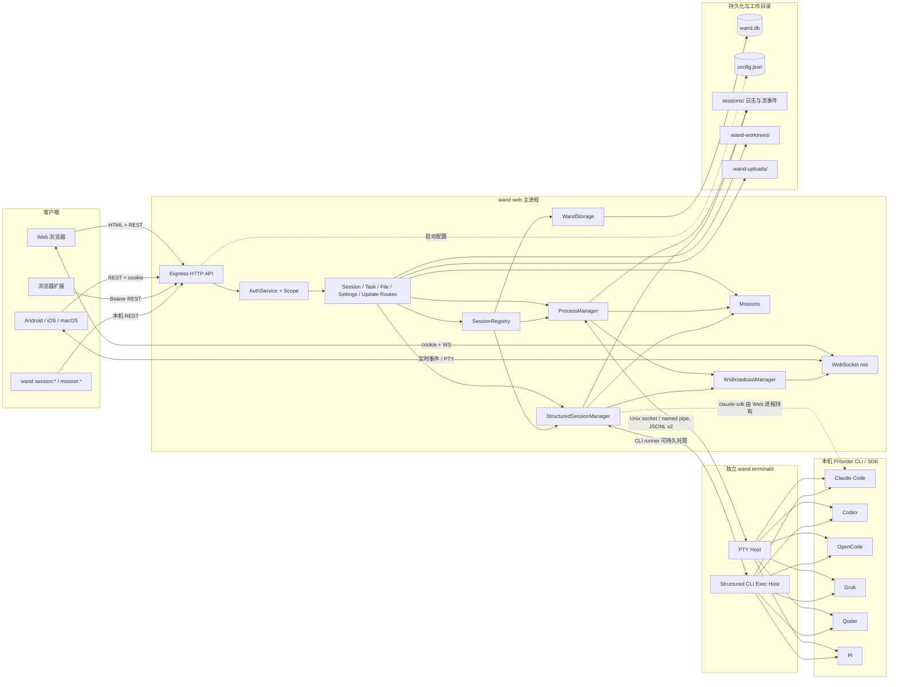
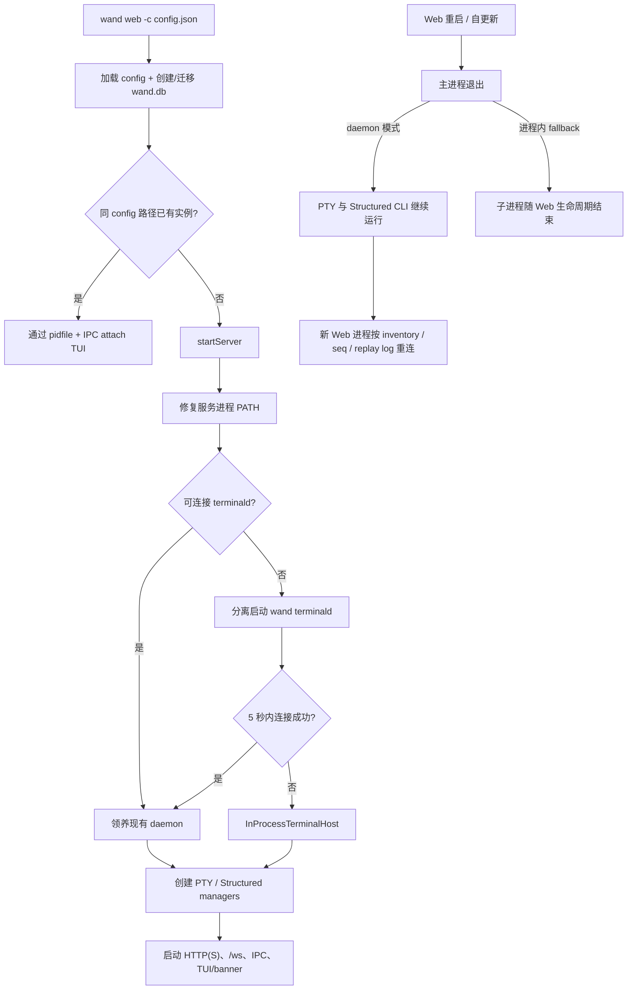
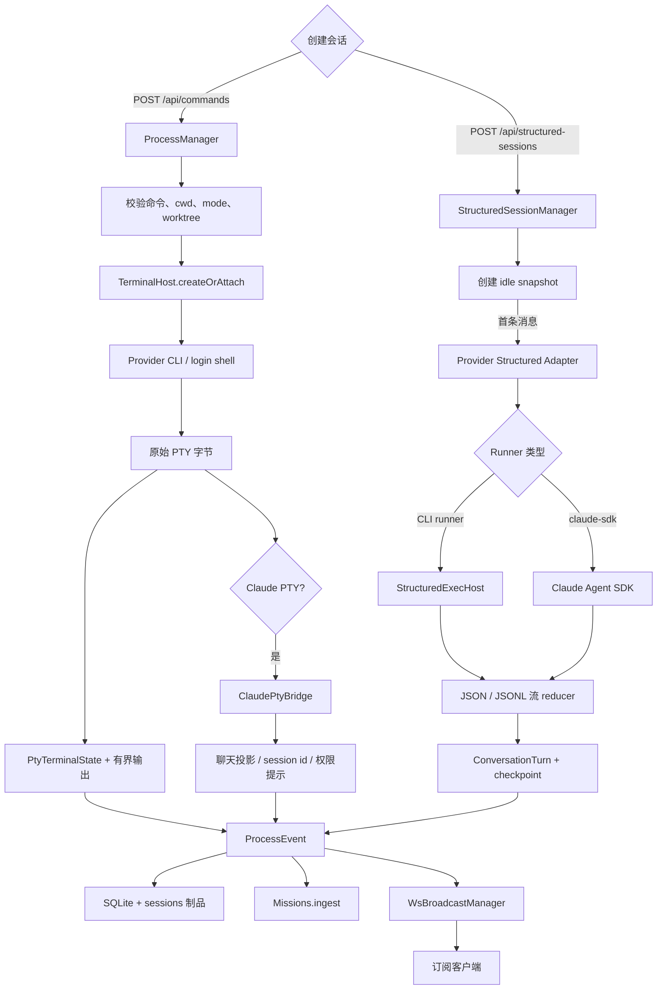
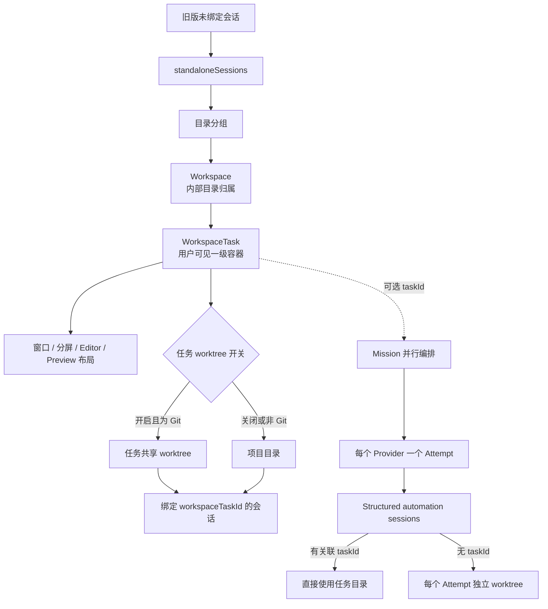
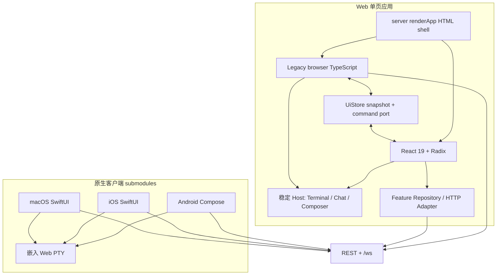
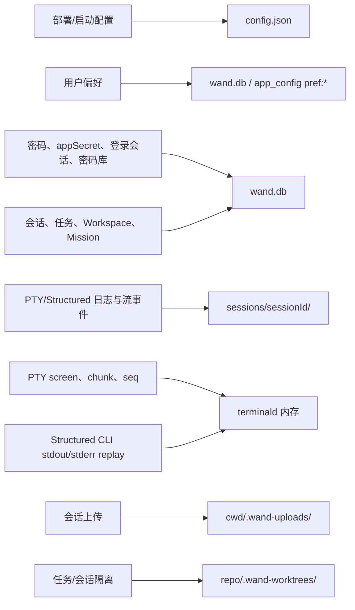
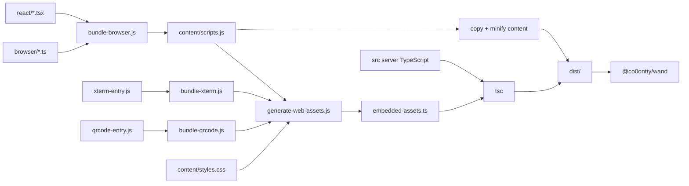

# Wand 架构图

最后更新：2026-08-29

本文描述当前 `master` 的运行时架构与代码边界。服务端行为细节见
[`docs/server-logic-analysis.md`](docs/server-logic-analysis.md)，客户端交互契约见
[`docs/client-logic-analysis.md`](docs/client-logic-analysis.md)，任务一级容器的多端状态见
[`docs/task-first-rollout.md`](docs/task-first-rollout.md)。

## 1. 系统全景

核心结论：

- `wand web` 是 HTTP、WebSocket、鉴权、业务路由和会话编排的组合根。
- PTY 和 Structured 是两套独立 runner；它们共享 `SessionSnapshot`、SQLite 和事件类型，
  但不共享执行、权限或恢复逻辑。
- `terminald` 默认持有 PTY，也可持有 Structured CLI 子进程。Web 重启后可重新连接；
  `claude-sdk` 仍属于 Web 进程，不能按 daemon CLI 路径恢复。
- `SessionRegistry` 只统一查询和修改分派，不把两个 manager 合并。

## 2. 进程与生命周期

单实例、daemon socket、token、pidfile 和 SQLite 都按 **config 文件路径** 隔离。
默认配置为 `~/.wand/config.json`；`-c /path/to/config.json` 会得到一套独立实例与数据目录。

`terminald` 协议定义在 `src/terminal-daemon-protocol.ts`：

- PTY：`createOrAttach`、`write`、`resize`、`kill`、`forget`，事件为 `data` / `exit`。
- Structured CLI：`structuredSpawn`、`structuredAttach`、`structuredList`、`structuredKill`、
  `structuredForget`，事件为 `sdata` / `sexit`。
- PTY 用 chunk `seq` 补洞；Structured 用 stdout/stderr replay log 恢复 reducer 状态。

## 3. 会话执行与事件流

### Runner 对照

| Provider | PTY | Structured |
| --- | --- | --- |
| Claude | `claude-cli` + 可选 `ClaudePtyBridge` | `claude-cli-print` 或 `claude-sdk` |
| Codex | `codex` TUI | `codex-cli-exec` |
| OpenCode | `opencode` TUI | `opencode-cli-run` |
| Grok | `grok` TUI | `grok-cli-headless` |
| Qoder | `qodercli` TUI | `qoder-cli-print` |
| Pi | `pi` PTY | `pi-cli-json` |

统一查询顺序为：Structured 内存 → PTY 内存/daemon 所有权 → SQLite durable fallback。
对应入口是 `SessionRegistry.ownerOf(id)`；排查会话问题时应先确认 owner。

## 4. 任务、Workspace、Mission 与 Worktree

- 用户信息架构以“任务”为一级容器；Workspace 仍负责 cwd、默认 provider 和持久布局。
- `GET /api/tasks` 聚合目录、任务、任务会话和未分组旧会话，供 Web 与原生客户端使用。
- 同一任务内的会话共享任务 worktree；独立 Mission 未绑定任务时，每个 provider attempt
  单独创建 worktree。
- Worktree 创建、合并和清理集中在 `src/git-worktree.ts`，会话删除会尽力清理其隔离目录。

## 5. 客户端架构

Web 不是纯 React：

- `src/web-ui/browser/` 仍拥有登录、WebSocket、会话合流、xterm、流式 Chat 和 Composer。
- `src/web-ui/react/` 拥有认证后 Shell、任务/Workspace、设置、新建会话、文件工具、
  快捷提交、Mission 和 worktree 合并等领域 UI。
- React 通过 `UiStore`、Repository 和 `*-adapter.ts` 与 legacy 层交互；两层不能同时拥有同一 DOM。
- `?reactUi=0` 回退整个 React UI/Shell；`?reactShell=0` 只回退 Shell。

Android、iOS、macOS 是独立 Git submodule。它们主要使用原生列表和聊天 UI；PTY 页采用
“原生顶栏 + `embed=terminal&nativeInput=1` WebView + 原生输入栏”的混合外壳。

## 6. 数据与状态落点

SQLite 迁移只允许加表、加列，不删除旧 schema。`SessionLogger` 文件制品与 SQLite
互补：SQLite 是会话快照、列表与恢复元数据真源，文件保留原始输出、结构化流事件和诊断材料。

## 7. Web 构建与发布产物

`content/scripts.js`、`embedded-assets.ts`、vendor bundle 和整个 `dist/` 都是生成产物，
不能手工修改。Android APK、iOS IPA、macOS DMG 在各自 submodule 中独立构建，再由
服务端分发目录或 GitHub Release 提供下载。

## 8. 不可破坏的边界

1. **先判断 owner**：所有会话查询和变更先按 `structured` / `pty` / `storage` 分派。
2. **不合并 runner**：PTY 与 Structured 只共享契约和存储，不共享执行实现。
3. **PTY 输入拆包**：客户端必须先发文本，再单独发 `"\r"`；服务端原样写入终端。
4. **权限能力不同**：运行时权限弹窗只属于 Claude PTY；Structured 通过启动策略控制权限。
5. **Provider resume ID**：`SessionSnapshot.claudeSessionId` 实际存所有 provider 的原生恢复 ID。
6. **daemon 是可降级能力**：正常模式可跨 Web 重启；测试或 daemon 失败时回退进程内生命周期。
7. **任务是用户一级容器**：新会话应绑定 `workspaceTaskId`；旧会话只通过未分组区兼容。
8. **状态分类不混写**：部署项进 JSON，偏好和密钥进 SQLite，大输出和活进程进文件/daemon。
9. **生成文件不手改**：前端源代码只改 `browser/`、`react/` 和 `content/styles.css`。
10. **原生客户端是子仓库**：改动必须在 submodule 内提交并推送，再更新主仓库指针。

## 9. 代码导航

| 领域 | 主要入口 |
| --- | --- |
| CLI、单实例、TUI attach | `src/cli.ts`、`src/pidfile.ts`、`src/tui/` |
| Web 组合根、鉴权、HTTP/WS | `src/server.ts`、`src/auth.ts`、`src/ws-broadcast.ts` |
| 会话 HTTP 契约 | `src/server-session-routes.ts`、`src/session-transport.ts` |
| PTY runner | `src/process-manager.ts`、`src/terminal-host.ts`、`src/claude-pty-bridge.ts` |
| Terminal daemon | `src/terminal-daemon-client.ts`、`src/terminal-daemon-server.ts`、 `src/terminal-daemon-protocol.ts` |
| Structured runner | `src/structured-session-manager.ts`、`src/structured-*-adapter.ts` |
| Structured daemon seam | `src/structured-exec-host.ts`、`src/structured-runner.ts` |
| 统一会话查找 | `src/session-registry.ts` |
| 持久化与日志 | `src/storage.ts`、`src/session-logger.ts` |
| 任务、Workspace、布局 | `src/server-workspace-routes.ts`、`src/workspace-binding.ts` |
| Mission / Inbox | `src/missions.ts`、`src/server-mission-routes.ts` |
| 文件、上传、Git/worktree | `src/server-file-routes.ts`、`src/upload-routes.ts`、 `src/git-worktree.ts` |
| Web legacy 层 | `src/web-ui/browser/` |
| Web React 层 | `src/web-ui/react/` |
| 原生客户端 | `android/`、`ios/`、`macos/` |
| 浏览器扩展 | `browser-extension/`、`src/password-manager.ts` |
